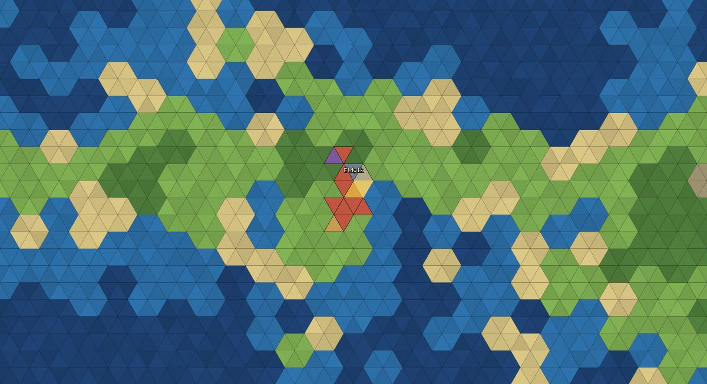

# HexGame — Vue Edition

A Patrician‑inspired economy builder on a hex map built from triangles. NPC towns
run self‑balancing supply chains; you found trading posts, lay out producers and
housing, and connect economies with cart routes.

The simulation core is **render‑free and fully unit‑tested**; the presentation layer
is **Vue 3 (runtime‑only) over a hand‑rolled Canvas 2D renderer**. The UI is in
German (the game's language); all code — identifiers and comments — is in English.



## Highlights

**Architecture**
- **Hard `core ↔ render` split.** `src/core/` is pure TypeScript game logic with no
  DOM or framework imports, covered by 93 unit tests. The renderer and UI can be
  swapped without touching the core.
- **Reactive state, plain simulation.** Only a small `display` projection is made
  reactive (`@vue/reactivity`); the simulation objects stay plain and are read by the
  render loop. This keeps the per‑tick economy fast and the reactivity surface tiny.
- **Triangle‑first coordinate system.** Every cell is a triangle `(x, y)`; a hexagon
  is an aggregation of six triangles, so the strategic hex view and the zoomed‑in
  triangle view are literally the same map at different levels of detail.

**Vue without the heavyweight toolchain**
- `@vue/runtime-dom` (runtime‑only) with **render functions (`h()`)** instead of SFCs
  — no `@vue/compiler-sfc`, no Babel/PostCSS. The whole overlay UI (HUD, info panel
  with interactive controls, build toolbar, town list, speedbar) is one component.
- **Canvas 2D** map renderer with pan/zoom, three LOD tiers and hover picking —
  browser API, zero dependencies.

**Supply‑chain‑hardened tooling** (3 npm packages total)
- `esbuild` as the only build tool (transpile + bundle + dev server).
- Tests on `node:test` via a tiny self‑written `vitest` shim — zero test packages.
- `pnpm` with `minimumReleaseAge`, blocked install scripts and an exact, checked‑in
  lockfile. See `PLAN.md` for the rationale.

## Gameplay features

- Found trading posts and build producers (sawmill, farm, mill, brewery, bakery,
  mine, smithy) and housing; the build cost is paid in wood from a nearby trading post.
- A self‑balancing economy: recipes, worker assignment by commute distance, food‑chain
  priority, volume‑based storage, maintenance.
- **Cart routes** between trading posts with selectable outbound/return freight;
  trading at NPC posts moves money.
- Per‑trading‑post storage limits (min reserve / max collection) and per‑producer
  max output.
- Z‑levels (basement / ground / upper floors), a town list to jump between posts,
  localStorage persistence, and keyboard + multi‑touch (pinch‑zoom) input.

## Commands

```sh
pnpm install --ignore-scripts   # esbuild binary arrives via optionalDependencies
pnpm dev                        # esbuild dev server with watch → http://127.0.0.1:8000
pnpm build                      # bundled, minified main.js
pnpm test                       # core unit tests via node:test (93 tests)
pnpm typecheck                  # tsc --noEmit (strict, noUnusedLocals)
```

## Project layout

```
src/
  core/      render-free simulation + unit tests (hex, tri, terrain, world,
             buildings, economy, routes, npc)
  render/    Canvas 2D map renderer, camera, outline
  game/      store (reactive display), operations, actions, persistence
  ui/        Vue overlay (hud.ts)
  main.ts    bootstrap: store, render/tick loop, input, debug API
```

## Context

This is a standalone, English, Vue rendition of a game whose render‑free core was
originally written in TypeScript + Pixi.js. The economy mechanics and the unit‑test
suite are ported 1:1; the Vue/Canvas presentation layer is built from scratch here.

A deliberate simplification versus the Pixi reference: the Canvas renderer draws in
immediate mode rather than caching map chunks. For the current map sizes this is
smooth; chunk caching is a possible later optimization (see `PLAN.md`).

## License

MIT — see [LICENSE](LICENSE).
